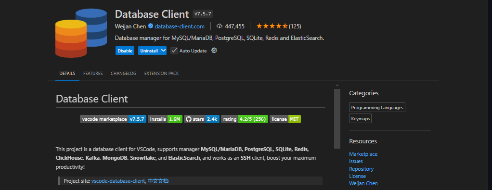

# # Golang RabbitMQ Consumer
[](https://skillicons.dev)

O RabbitMQ é um message broker altamente consolidado e utilizado por quem trabalha com comunicação entre sistemas. Operando de forma assíncrona, ele age como um intermediário que processa as nossas mensagens entre produtores e consumidores, além de contar com filas que possuem diversas opções de encaminhamento.

Para entender melhor o que é e como ele funciona [acesse](https://github.com/wesleysbmartins/rabbitmq).

Esta aplicação é um exemplo de Consumer do RabbitMQ em Golang, nela utilizamos o pacote [**amqp**](https://pkg.go.dev/github.com/streadway/amqp), como um driver para integrar a aplicação ao message broker RabbitMQ.

### Pré-Requisitos
Para executar esta aplicação será necessário ter em seu ambiente o [Docker](https://docs.docker.com/engine/install/) para os containers da própria aplicação quanto do RabbitMQ. Com o Docker instalado podemos seguir o passo a passo.

### Caso de Uso
Esta aplicação foi desenvolvida para receber **Sales** ou Vendas, que serão recebidas pelas exchanges e filas configuradas.

Entidade Sale:
```go
package entities

type Sale struct {
	SellingCompany     string `json:"sellingCompany"`
	Product            string `json:"product"`
	Price              string `json:"price"`
	DeliveryCompany    string `json:"deliveryCompany"`
	OriginAddress      string `json:"originAddress"`
	DestinationAddress string `json:"destinationAddress"`
	ClientName         string `json:"clientName"`
	Order              int64  `json:"order"`
}
```
Este é o objeto que o Message Broker vai receber e aplicação realizara o processamento.

### Container RabbitMQ
Com o Docker presente em seu ambiente, podemos realizar o download da imagem do RabbitMQ:
```shell
$ docker pull rabbitmq:management
```
Execute um conteiner do RabbitMQ passando suas credenciais de usuário, senha e portas:
```shell
docker run -d --name rabbitmq -p 5672:5672 -p 15672:15672 -e RABBITMQ_DEFAULT_USER=<user> -e RABBITMQ_DEFAULT_PASS=<password> rabbitmq:management
```
Pronto, você tem um RabbitMQ operando em seu ambiente!

### Configuração da Aplicação
Antes de executar a aplicação deverá ser preenchido arquivos de configuração, semelhantes aos conhecidos arquivos **.env**, mas neste caso utilizaremos arquivos de extensão **yml**.

Na pasta config presente na raiz do projeto, você deverá criar um arquivo chamado **rabbitmq.yml**, e inserir os seguintes valores:
```yml
host:     "<host do rabbitmq>"
port:     5672
user:     "<usuário do rabbitmq>"
password: "<senha do rabbitmq>"
```
Estas seriam as credenciais necessárias para conexão com o RabbitMQ.

Também será necessário criar um arquivo que contém as configurações de seu Producer, contento informações de sua Exchange, Queue e Message, nomeie como **sale-producer.yml**:
```yml
exchange: {
  name: "exchange-name", //nome da exchange
  kind: "direct", //tipo da exchange
  durable: false,
  auto-delete: false,
  internal: false,
  no-wait: false,
  args: {}, // argumentos de configuração mais especificos como x-message-ttl em milisegundos
  bind: "", // nome da exchange que deseja criar um bind, ou seja, a mensagem recebida será enviada para esta exchange também
}
queue: {
  name: "queue-name", // nome da fila
  durable: false,
  exclusive: false,
  auto-delete: false,
  no-wait: false,
  args: {}, // argumentos de configuração mais especificos como x-message-ttl em milisegundos
  bind: "", // nome da fila que deseja criar um bind, ou seja, a mensagem recebida será enviada para esta fila também
}
consumer: {
  name: "consumer-name", // nome do consumer
  auto-ack: false,
  exclusive: false,
  no-local: false,
  no-wait: false,
  args: {}, // argumentos de configuração mais especificos como x-message-ttl
}
```

Substitua os valores genéricos por suas configurações de preferência, eles serão lidos e convertidos em configurações de seu **Consumer**, com base neles serão criados suas **Exchanges, Binds e Queues**.


Crie a imagem no Docker:
```shell
docker build -t consumer_service .
```

Execute o container:
```shell
docker run consumer_service
```

Você deve ter um resultado semelhante a este:
```
RABBITMQ CONNECTION SUCCESS!
 [*] Waiting for messages. To exit press CTRL+C
Consumming:  sale-consumer
```

Para testar estou utilizando uma extensão do VSCode que are conexões com bancos de dados, message brokers, servidores e entre outros chamado **Database Client**, onde posso me conectar e enviar mensagens as filas do RabbitMQ:



Mensagem de exemplo:
```json
{
	"sale":{
        "sellingCompany": "Magalu",
        "product": "Notebook Lenovo",
        "price": "R$2.255,90",
        "deliveryCompany": "Correios",
        "originAddress": "Alameda Santos - Cerqueira César, São Paulo - SP, 01418-970",
        "destinationAddress": "Parque da Independência - Ipiranga, São Paulo - SP, 04263-000",
        "clientName": "João da Silva",
        "order": 123456789
    },
    "appId": "postman collection",
    "userId": "postman runner"
}
```

Ao enviar a mensagem, o resultado no seu terminal deverá ser semelhante a este:
```
Message: [RoutingKey: sale-queue, Consumer: sale-consumer, Delivery: 1, Count: 0]
 Sale: [Order: 123456789, Product: Notebook Lenovo, Company: Magalu, Client:João da Silva]
```

Sendo assim, você tem uma aplicação Golang consumindo dados de uma fila do RabbitMQ.